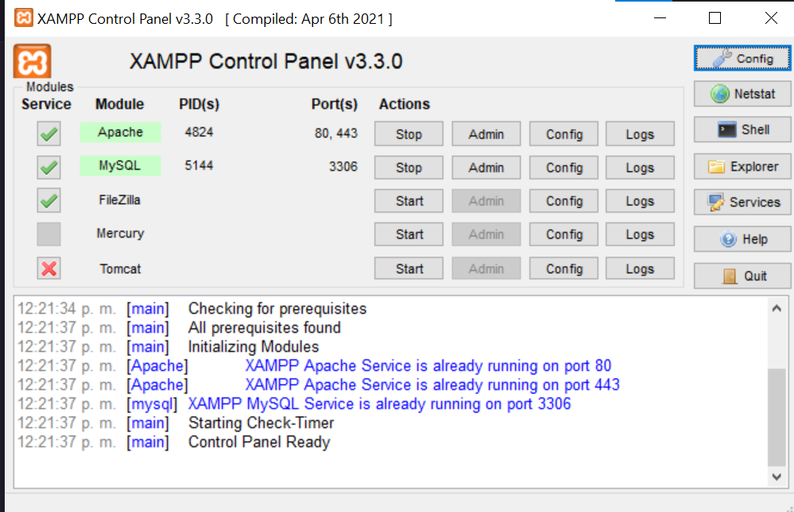
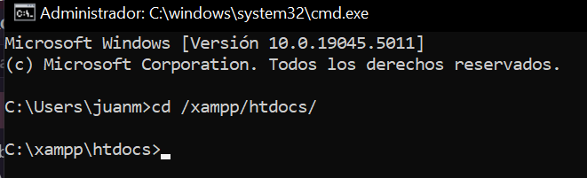
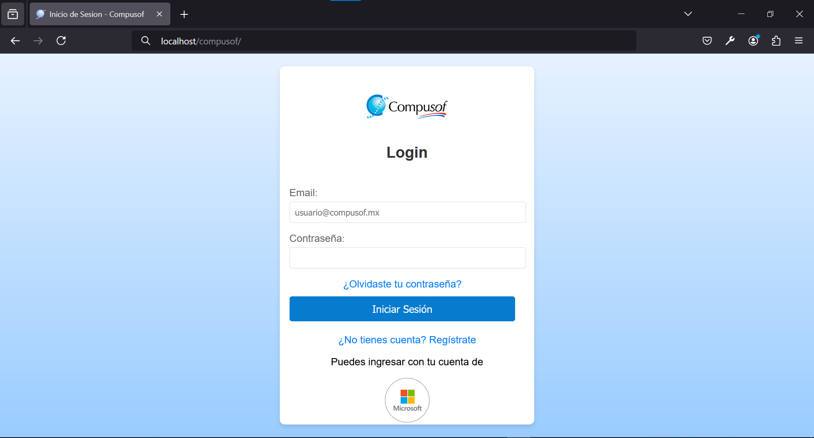

# Sistema WEB para Gestion de Tickets e IDC con PHP, JS y PYTHON
- Este proyecto se realiza para el area de servicio en la empresa COMPUSOF MÉXICO y asi poder 
  aprovisionar de caracteristicas faltantes al sistema que tienen en funcionamiento en dicha area.
## Requerimientos antes de poder ejecutar
Antes que nada debemos tomar en cuenta ciertos requerimientos para ejectuarlo de manera correcta.
- 1- Tener un entorno de desarrollo local (XAMPP, WAMP, LAMPP o MAMP)
- 2- Despues de haber instalado el entorno, iniciar las opciones de APACHE Y MYSQL(color verde), 
  los cuales nos ayudaran a tener el servidor para su visualizacion y un Gestor de base de datos (phpmyadmin)

  
- 3- El usuarios de phpmyadmin debe ser `root` y sin contraseña; para verificarlo debemos colocar `localhost/phpmyadmin/` en nuestro navegador.
  
- 4- Crear una base de datos presionando el boton `Nueva` -> teclar **Compusof** ->`Crear`.

- 5- Crear tablas en la base de datos, en la carpeta `compusof/model/tables.sql` copiar las inserciones y pegarlo en el apartado de **SQL** y presionar `continuar`.

## Clonar proyecto 
- 1- Abrir el simbolo del sistema y colocar esta ruta `cd /xampp/htdocs`->presionar **Enter**

- 2- Escribir `git clone https://github.com/CompusofUser/Compusof.git`
- 3- Listo
## Ejecucion del Sistema Web 
- 1- Ingresar a cualquier navegador y colocar en la barra `localhost/compusof/`

## Estructura del proyecto 
- `model` contiene la logica de acceso a base de datos.
- `view` contiene lo que el usuario ve, los datos de salida.
- `controller` contiene la logica que manipula los datos.

## Enlaces utiles
- Descarga de entrono ->[xampp.com/descargar](https://www.apachefriends.org/es/index.html)
- Comunidad Apache -> [apache.com/friends](https://www.apachefriends.org/es/community.html)
- Dependecia cheackin -> [composer.com/docs](https://getcomposer.org/)

## Detalle de ejecución 

- Xampp 8.2.12
- Visual Studio Code 1.94
- Composer 2.8.1
Windows 10 10.0
